<h1 align="center">Welcome to RETROGRAM!</h1>

  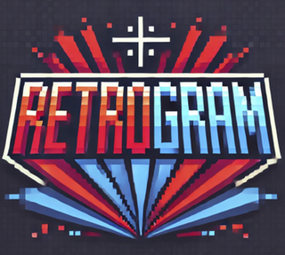

## About the Project

Retrogram is an image gallery for both - photography and pixelart enthustiasts that brings back the feeling of the early nineties computer game era.

## Features

- Login via Google or Github
- Liking and saving images as favorites
- Uploading of new fotos and generating a pixelart version of it
- Switching between retro view and normal mode at any time
- foto details page with comment functionality
- Fully responsive design that works on mobile devices as well

## Used Tools & Technologies

`HTML / CSS` `Javascript` `React` `Next.js` `NextAuth.js` `Cloudinary` `OpenAI (Dalle-3)` `MongoDB` `mongoose`

## Demo Images

    <h3>- Switch at any time to Retro Mode</h3>
    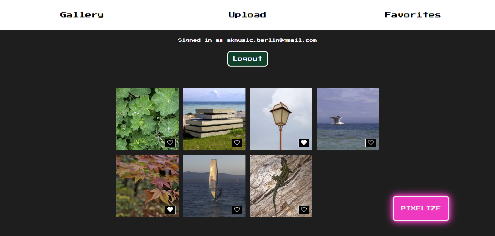 
    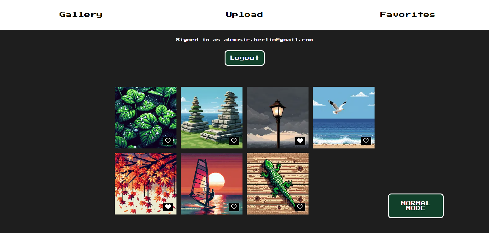
    <h3>- Save your favorite pixel-art creations as favorites</h3>
    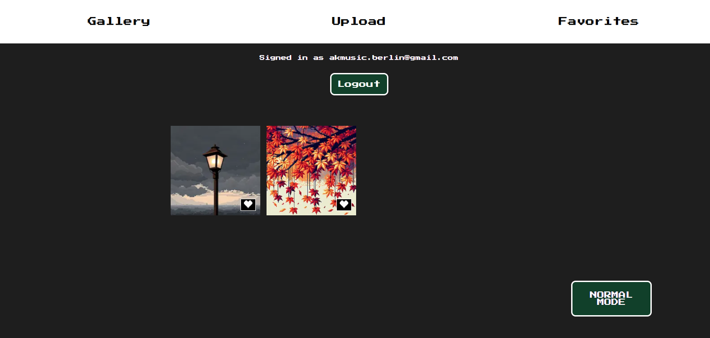
    <h3>- Upload new fotos and generate pixel-art versions of it</h3>
    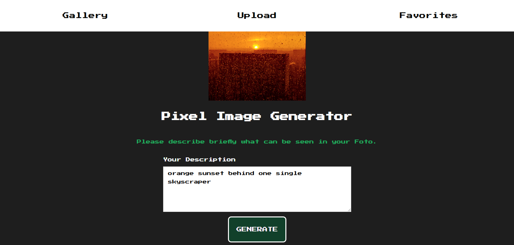
    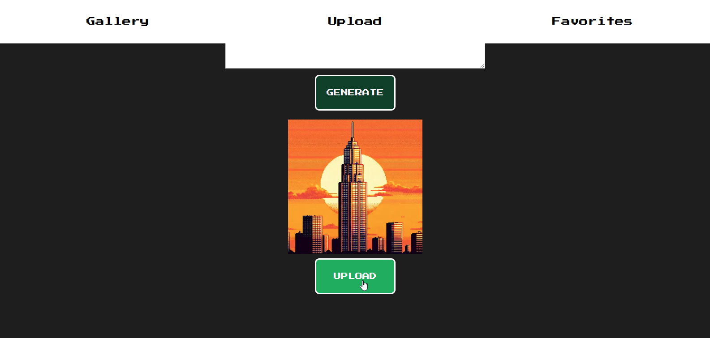
    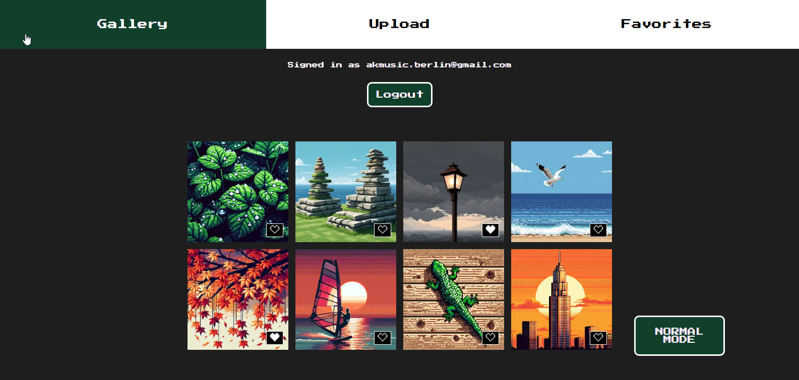
    <h3>- Leave comments and exchange with other users</h3>
    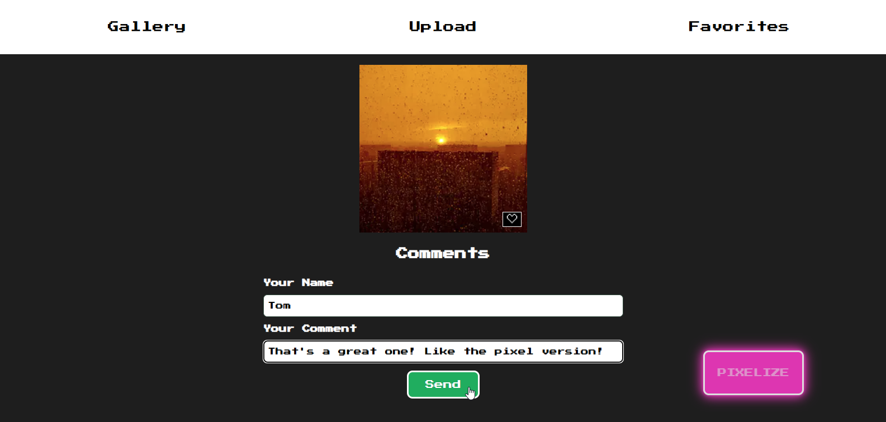
    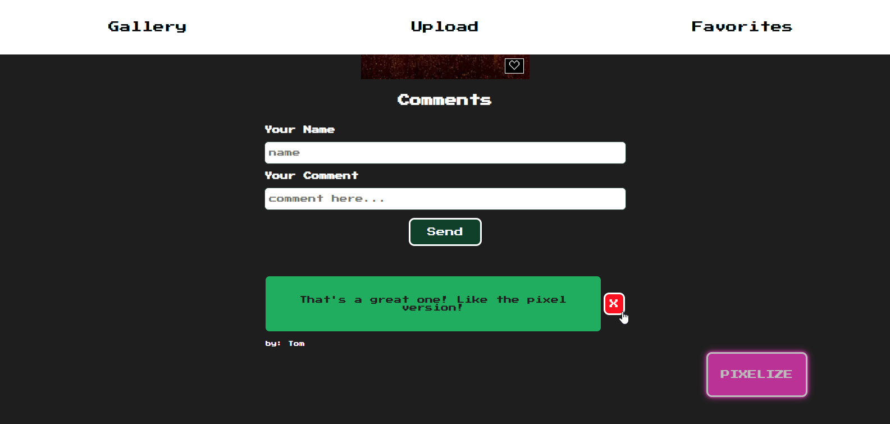
    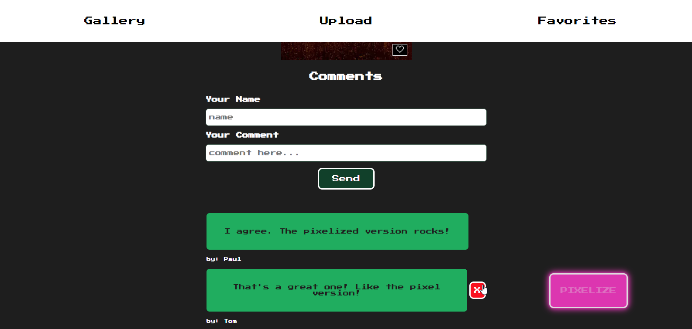

<h3>- Enjoy the app also on your mobile devices</h3>    
    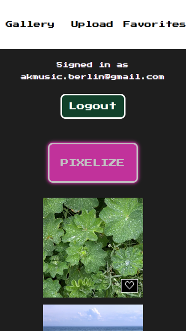
    
    
    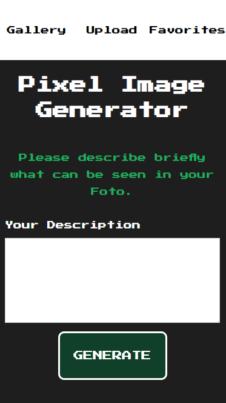

## Future Features & Ideas

- Users will be able to delete their uploaded fotos again
- Users can decide for each single foto separately if he / she wants to se the retro or normal version
- Guest view: not logged in users can see all creations, but cannot like, comment, generate or delete pictures
- Images can be sorted by most likes / images with most likes are fetured on guest view
- Image to image generation - ai will analyze the uploaded image automatically and transform it into a pixelized version - need of foto description anymore
- Users can also upload an a pixel-art version of his / her picture that was generated on other platforms than retrogram
- Users will have a profile page, where they can choose a profile picture and a nickname
- User can choose also other models than dalle-3
- User can mark uploaded picture as public / private and can decide if the pictures will be visible to all users and guests
