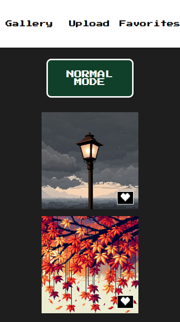
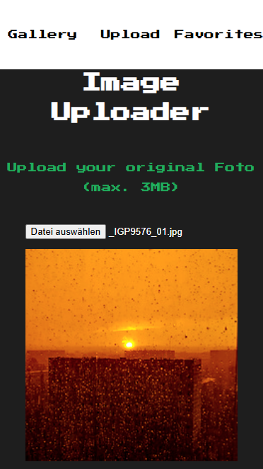

<h1 align="center">Welcome to RETROGRAM!</h1>

  

## About the Project

Retrogram is an image gallery for both - photography and pixel art enthustiasts that brings back the feeling of the early nineties computer game era.
The goal for the users should be to create pixel art versions of their photos that are as close as possible to the original scene.

## Features

- Login via Google or Github
- Liking and saving images as favorites
- Uploading of new photos and generating a pixel art version of it
- Switching between retro view and normal mode at any time
- photo details page with comment functionality
- Fully responsive design that works on mobile devices as well

## Used Tools & Technologies

`HTML / CSS` `Javascript` `React` `Next.js` `NextAuth.js` `Cloudinary` `OpenAI (Dalle-3)` `MongoDB` `mongoose`

## Demo Images

### `Switch at any time to Retro Mode`

     
    

### `Save your best pixel art creations as favorites`

    

### `Upload new photos and generate pixel art versions of them`

    
    
    

### `Leave comments and exchange with other users`

    
    
    

### `Enjoy the app also on your mobile devices`

|  |  |  |  |
| :-----------------------------------------------: | :-----------------------------------------------: | :-----------------------------------------------: | :-----------------------------------------------: |

## Future Features & Ideas

- Users will be able to delete their uploaded photos again
- Users can decide for each single photo separately if he / she wants to see the retro or normal version
- Guest view: Not logged in users can see all creations, but cannot like, comment, generate or delete pictures
- Images can be sorted by highest amount of likes / images with most likes are featured on guest view
- Image to image generation - AI will analyze the uploaded image automatically and transform it into a pixelized version - no need of photo description anymore
- Users can also upload a pixel art version of his / her picture that was generated via other platforms than Retrogram
- Users will have a profile page where they can choose a profile picture and a nickname
- Users can choose also other models than dalle-3
- Users can mark uploaded pictures as public / private and can decide if the pictures will be visible to all users and guests
- Save the image descriptions that were used to create the pixel art version
